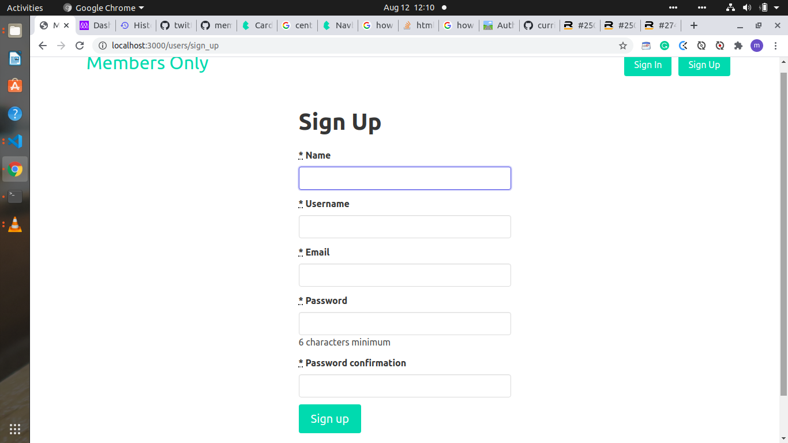
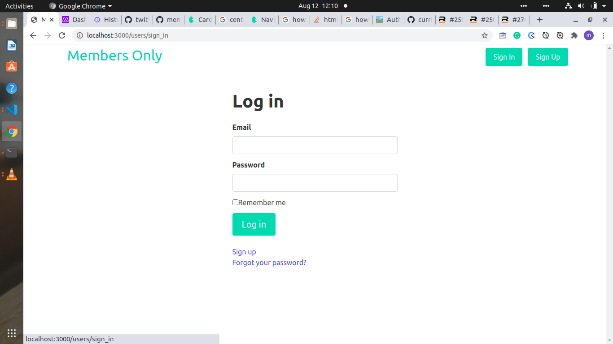
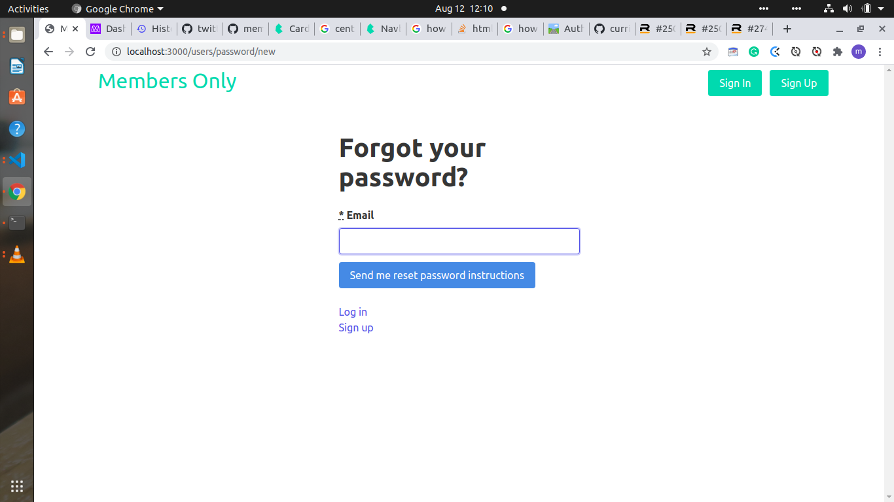
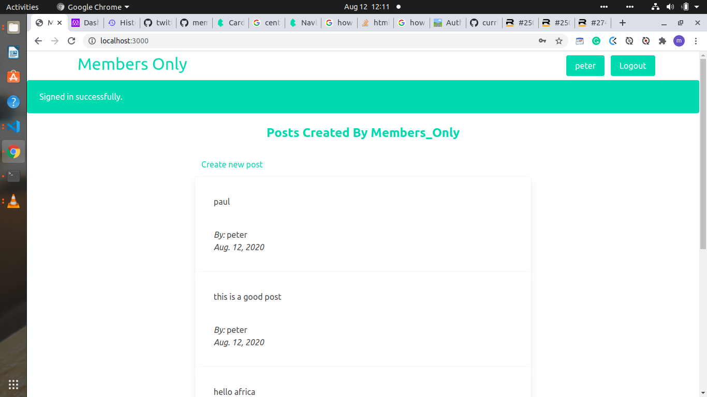

# members-only

TMembers can post public messages, but only members can see who posted the messages!  
This Rails project utilizes a 'roll-your-own' authentication system and a bootstrapped (mostly) responsive design.

![members-only]

## Live Demo
[Members Only on Heroku]()

(View the 'about' page to find login information!)

## Installing
This deploys easily, as a fairly simple Rails app with limited dependencies.  
Just remember to run `rails db:seed` after `rails db:migrate`, in order to have a few initial members to work with!

## Authors

👤 **Morah Paul**

- GitHub:[@github/chinweokwu](https://github.com/chinweokwu)
- Linkedin:[linkedin/morah](https://www.linkedin.com/)

👤 **Oksana Petrova**

- GitHub:[@github/Laguna1](https://github.com/Laguna1)
- Linkedin:[linkedin/OksanaPetrova](https://www.linkedin.com/in/oksana-petrova/)
- Twitter:[@OksanaP48303303](https://twitter.com/OksanaP48303303)

## 🤝 Contributing

Contributions, issues, and feature requests are welcome!
Feel free to check the [issues page]().

## Show your support

Give a ⭐️ if you like this project!
